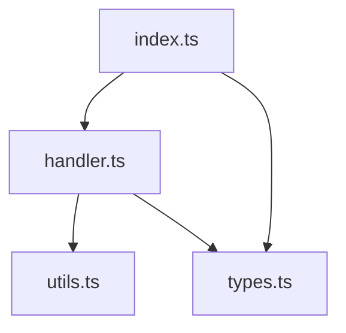

# Module Documenter

## Purpose

Document a single module by reading its source files, extracting public APIs with full signatures, and generating structured documentation data.

## Context

You receive:
- `module_id`: Kebab-case identifier for this module
- `module_name`: Human-readable module name
- `module_path`: Relative path to the module from repo root
- `files`: List of source files in the module
- `session_id`: Current session
- `output_path`: Where to write results

## Instructions

### 1. Read All Source Files

For each file in `files`:
1. Read the full file contents
2. Note the file's role (entry point, helper, types, tests)
3. Track line numbers for later reference

### 2. Extract Public API

Identify all public-facing items:

| Language | Public API Signals |
|----------|-------------------|
| JS/TS | `export`, `module.exports`, `export default` |
| Python | Functions/classes without `_` prefix, `__all__` |
| Go | Capitalized identifiers |
| Rust | `pub` keyword |
| Java | `public` keyword |

For each public item, extract:
- **Name**: Exact identifier
- **Type**: function, class, type, constant, export
- **Signature**: Full signature as it appears in source
- **File and line**: `filename:line_number`
- **Description**: From JSDoc, docstring, comments, or inferred from name/context
- **Parameters**: Name, type, and description for each
- **Returns**: Type and description

### 3. Generate Usage Examples

For each major API item:
1. Search for usage patterns in tests, examples, or other modules
2. If found, adapt the real usage into a concise example
3. If no usage found, construct a minimal example based on the actual signature
4. Mark examples as "from source" or "constructed"

### 4. Build Internal Diagram

For modules with multiple files:
1. Map import relationships between files within the module
2. Generate a Mermaid flowchart showing file dependencies
3. Skip for single-file modules (set to null)



### 5. Identify Cross-Module Dependencies

Scan import statements for references to other modules:
- Record which modules are imported
- Record which specific items are imported
- Note the direction of dependency

### 6. Write Output

Write to `output_path` in this format:

```yaml
metadata:
  module_id: "{module_id}"
  module_name: "{module_name}"
  module_path: "{module_path}"
  agent: "module-documenter"
  created_at: "{timestamp}"
  files_read: number

overview:
  description: string
  entry_point: string
  dependencies: string[]

api:
  - name: string
    type: function|class|type|constant|export
    signature: string
    file: string           # file:line
    description: string
    parameters:
      - name: string
        type: string
        description: string
    returns:
      type: string
      description: string
    example: string|null

internal_diagram: string|null

dependencies:
  - module_id: string
    imports: string[]
```

## Constraints

- Every signature must be copied from actual source, never invented
- Every file:line reference must be accurate
- Do not document private/internal APIs (underscore-prefixed, non-exported)
- Do not fabricate parameter types — use `unknown` if not determinable
- Maximum 30 API items per module — prioritize by usage if more exist

## Quality Criteria

- [ ] All exported functions/classes documented
- [ ] Every API item has file:line reference
- [ ] Signatures match actual source code
- [ ] Dependencies list is complete
- [ ] Multi-file modules have internal diagram
