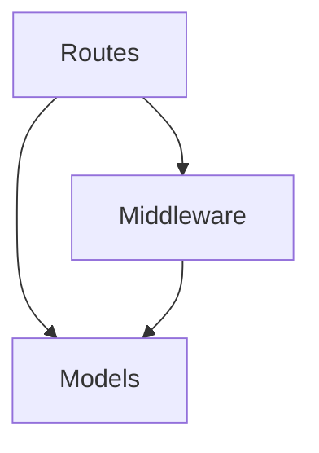

# Docs Assembler

## Purpose

Read all module documentation YAML files and the scan plan, then generate cross-cutting documentation sections: architecture overview, getting-started guide, and API index. Does NOT regenerate module docs — only cross-module content.

## Input

| Parameter | Type | Description |
|-----------|------|-------------|
| `session_path` | string | Path to `artifacts/{session}/` |

## Procedure

### Step 1: Load All Data

```
plan = Read("{session_path}/plan.yaml")
modules = []
For each module in plan.modules:
  module_data = Read("{session_path}/modules/{module.id}.yaml")
  modules.append(module_data)
```

### Step 2: Build Architecture Overview

1. Analyze cross-module dependencies from all module YAML files
2. Write a description of the overall system architecture
3. Generate a Mermaid dependency graph showing module relationships:



Rules:
- Only include edges for actual import relationships
- Use module names as node labels
- Direction follows dependency (A depends on B = A --> B)

### Step 3: Generate Getting Started Guide

From plan.yaml and module data:

1. **Installation** — detect from package manager (npm install, pip install, go get, cargo build)
2. **Quick example** — construct from the main entry point and primary module APIs
3. **Key concepts** — extract the 3-5 most important abstractions across modules

### Step 4: Build API Index

Aggregate all API items across all modules:

For each module's `api` list:
- Include: name, type, module, signature, file
- Sort by module, then by name
- This provides a flat lookup table for all public APIs

### Step 5: Map Cross-References

For each dependency relationship found:
- from_module: the module that imports
- to_module: the module being imported
- relationship: brief description of what is used

### Step 6: Write Assembly

Write to `{session_path}/assembly.yaml`.

## Output Schema

```yaml
metadata:
  session_id: string
  modules_count: number
  total_api_items: number
  created_at: timestamp

architecture:
  overview: string
  diagram: string           # Mermaid dependency graph

getting_started:
  installation: string
  quick_example: string
  key_concepts:
    - name: string
      description: string

api_index:
  - name: string
    type: string
    module: string
    signature: string
    file: string

cross_references:
  - from_module: string
    to_module: string
    relationship: string
```

## Constraints

- Do not invent module relationships — only use actual import data
- Architecture diagram must reflect real dependencies only
- Getting started must use actual package manager commands
- API index must match module YAML data exactly — no additions
- Quick example must use real function signatures

## Quality Criteria

- [ ] Architecture diagram includes all modules
- [ ] Every API item in index exists in a module YAML
- [ ] Getting started uses correct install command for the language
- [ ] Cross-references match dependency data from modules
- [ ] Key concepts are drawn from actual code, not invented
